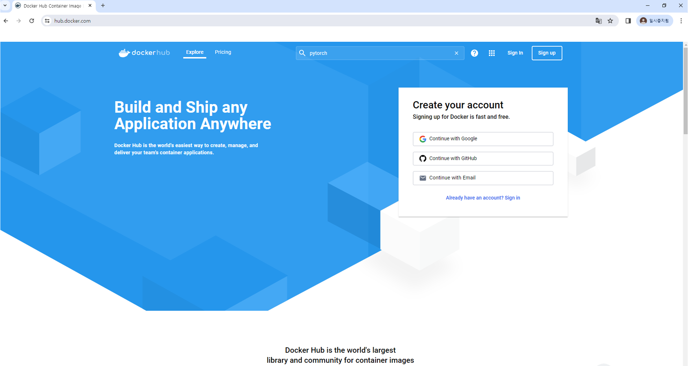
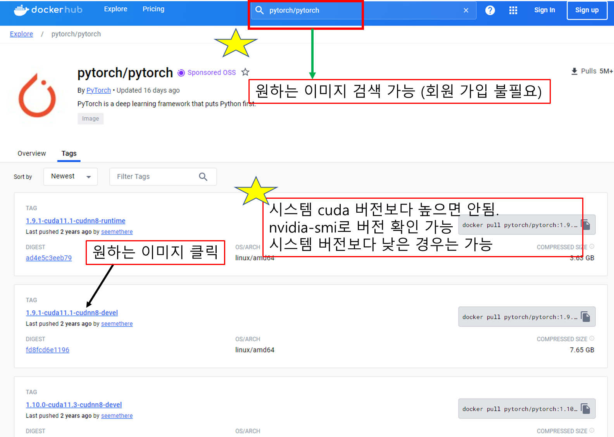
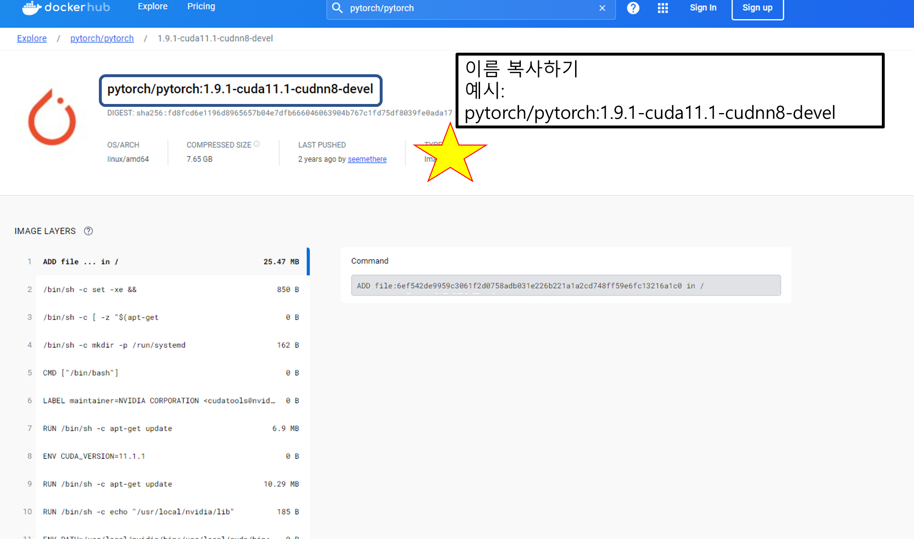

# 소개

인하대학교 인공지능융합연구센터 (이하 ”AI 센터”)에 오신 것을 환영합니다. 저희 AI 센터는 최첨단 GPU 서버 센터를 구축하여 A100, A6000, A40 등의 고성능 컴퓨팅 자원을 인하대학교 학생 및 교수님들, 그리고 기업체 및 인천시민 여러분께 무상으로 제공하고 있습니다. 이를 통해 인공지능 연구와 개발에 필요한 모든 고성능 계산 작업을 지원하고자 합니다.
<br/>작성된 튜토리얼을 통해 원활한 사용과 연구에 도움이 되기를 진심으로 바라겠습니다.

<aside class="notice">
AI 센터의 자원을 이용하시려면 먼저 <a href='https://aix.inha.ac.kr/?page_id=4109&vid=1' target="_blank">인하대학교 인공지능융합연구센터 홈페이지</a>를 통해 계정을 신청하시기 바랍니다.
</aside>

공지 수신 및 기술적인 문제나 사용법에 대한 질문이 있으시면, [디스코드 채널](https://discord.gg/PyBkTDz4Mp)에 입장하여 연락주시기 바랍니다.
<br/>추가로, 긴급 공지 사항을 위해 만들어진 [카카오오픈채팅방](https://open.kakao.com/o/gNVmxJof)에 반드시 참여를 부탁드립니다.

### System Overview
Simple Linux Utility for Resource Management (이하 “Slurm”) 을 통해 GPU 자원을 제공하고 있습니다. Slurm은 클러스터 환경의 자원 관리 시스템으로, 사용자의 요청에 컴퓨팅 자원을 할당합니다.  
<br/> 사용자는 자원을 할당 받은 후, Conda와 Singularity 컨테이너 솔루션을 통해 사용자가 원하는 개발 환경에서 컴퓨팅 자원을 사용 할 수 있습니다.

자원이 모두 사용 중일 때는 대기를 해야하며, 자원이 확보될 시 Slurm이 대기하고 있던 사용자에게 할당해줍니다. <br/>
12시간 이상 GPU 사용이 없을 시 작업이 취소 될 수 있습니다.

### GPU 보유 현황
AI 센터에서는 11개의 GPU 서버 (56 GPUs) 를 제공하고 있습니다. 

| GPU 타입 | GPU 메모리 | GPU 서버 대수 | 서버 당 GPU 카드 개수 |
|----------|------------|-----------------------|---------------|
| A100     | 40 GB      | 4                     | 4             |
| A40      | 48 GB      | 3                     | 8             |
| A6000    | 48 GB      | 4                     | 4             |


# 사용 방법
### 사용 절차
GPU 서버 사용 과정은 아래와 같습니다:<br/>
SSH 로그인을 통한 서버 접속 (Login Node) -> 코드 및 데이터 업로드 -> GPU 자원 신청 -> (환경 구축) -> GPU 사용


## GPU 서버 접속
> "yourID"를 본인의 ID로 입력하여 SSH 연결하시길 바랍니다.

```shell
ssh "yourID"@165.246.75.159
```

사용자는 SSH 연결을 통해 Login Node 에 접속한 후, Slurm 시스템에게 GPU 자원 할당을 신청 할 수 있습니다.
<br/> SSH 연결은 Windows PowerShell, Ubuntu Terminal, MobaXterm 등의 프로그램을 통해 사용 할 수 있습니다.


## 코드 및 데이터 업로드
파일 업로드는 본인 계정의 이름으로 된 폴더에 할 수 있습니다.<br/>
파일 업로드는 GPU 자원을 할당 받지 않고도 가능하며, 로컬 디스크 사용의 경우 CPU 자원만을 할당받아 하시면 됩니다.

## 자원 신청
> 먼저 명령어로 자신의 파티션을 확인하기 (주의: `는 ' 와 다름)

```shell
sacctmgr show assoc format=User,Partition where user=`whoami`
```

<aside class="notice">
GPU 신청 전에, 자신의 파티션을 먼저 확인하길 바랍니다.
</aside>

> 파티션 p1의 사용자가 A100 GPU 2개를 1일 동안 요청하기

```shell
srun --gres=gpu:a100:2 -p p1 --time=1-00:00:00 -J cv_lab1 --cpus-per-task=20 --pty bash
```
> 파티션 p2의 사용자가 A6000 GPU 2개를 12시간 동안 요청하기

```shell
srun --gres=gpu:a6000:2 -p p2 --time=12:00:00 -J cv_lab1 --pty bash
```

> 파티션 p3의 사용자가 A40 GPU 2개를 2일 동안 요청하기

```shell
srun --gres=gpu:a40:2 -p p3 --time=2-00:00:00 -J cv_lab1 --pty bash
```

로그인을 한 후, 명령어로 GPU 할당 요청이 가능합니다.<br/>
`srun --gres=gpu:<type>:<number> -p <partition> --time=<time> -J <jobname> --cpus-per-core <int> --pty bash`


## 개발 환경 구축
현재 GPU 서버에서는 miniconda 환경과 singularity 환경을 지원하고 있습니다.
<br>별도의 docker환경은 제공하지 않지만, [singularity image 변환](#singulairty-container)을 통해 docker image를 사용하실 수 있습니다.

## miniconda 환경 설정

> 설치 파일을 다운로드할 경로로 이동(to home directory)

```shell
cd ~
```
> Miniconda 설치 파일 다운로드

```shell
wget https://repo.anaconda.com/miniconda/Miniconda3-latest-Linux-x86_64.sh
```

> 설치 파일 실행

```shell
bash Miniconda3-latest-Linux-x86_64.sh
```
> Anaconda 설치 후 재접속

```shell
exit
```
> conda 환경 생성 예시

```bash
conda create -n <환경 이름> python=<파이썬 버전>
```
> conda 환경 실행

```bash
conda activate <환경 이름>
```

<aside class="warning"> <i>conda: command not found</i> 오류 발생시 우측 예시와 같이 환경설정을 해야 함.</aside>


>다음 명령어 수행 (conda 환경설정 오류가 발생했을 경우에만)

```shell
vi ~/.bashrc
```
>vi 편집기에서 입력모드(i)로 들어가서 파일끝에 다음 명령어 추가 후 저장(esc, :wq)하기.

```bash
export PATH=~/miniconda3/bin:$PATH
```
>환경변수 설정 반영

```shell
source ~/.bashrc
```

## Jupyter notebook 실행
할당받은 GPU 노드에서 IP를 알아 낸 후, jupyter notebook을 웹에 띄웁니다.

>다음 명령어 수행후, inet 165.246.***.*** 부분의 ip주소를 복사

```shell
ifconfig
```
>위에서 복사한 ip주소를 <165.246.***.***> 부분에 넣고 port번호는 10100~10109 중 하나로 설정

```shell
jupyter-notebook --no-browser --ip=<165.246.***.***> --port=<port number>
```

<aside class="warning">만약 port 번호를 10100으로 설정했는데 실행이 안될경우, ⭐숫자를 1씩 증가시켜가며⭐ 실행되는 port 번호를 사용하면 됩니다. 만약 모든 포트번호를 사용했는데 실행이 안되는 경우, 아래의 연락처로 연락주시면 감사하겠습니다.<br>문의처: 인공지능융합연구센터 조병호 (bhjo12@inha.ac.kr, 032-860-9472) </aside>

## singulairty Container 활용
<aside class="notice">
도커 이미지를 Singularity 이미지로 간편하게 변환하여 사용할 수 있습니다.
</aside>

### sif이미지를 사용해서 singularity container 실행
우측 코드를 참조하여 실행

> 공용폴더(/shared/public/images)로 이동

```shell
cd /shared/public/images

#공용폴더에서 사용할 Singularity 이미지(.sif)를 확인
ls
```

> 원하는 이미지가 있고, 이를 사용하려면 다음 명령어 실행

```shell
singularity exec --nv /shared/public/images/<imagefile name> bash
```
>만약 이미지를 jupyter notebook으로 실행시키고 싶다면

```shell
singularity exec --nv /shared/public/images/<imagefile name> jupyter notebook --no-browser --ip=<위에서 복사한 ip주소> --port=<위에서 설정한 포트번호>

#singularity Container의 사용을 중단하고 싶다면
exit
```
<aside class="warning">
<code>/shared/public/images</code> 경로에 Singularirty 이미지를 저장하지 마세요.
본인계정의 home 경로에 저장하시길 부탁드립니다.
</aside>

### Docker 이미지를 Singularity SIF로 변환하기 - Docker Hub 사용편

1. Docker 이미지 선택 : Docker hub에서 변환하고자 하는 Dokcer image의 url을 찾습니다.
<br> 이때, 본인이 원하는 이미지가 docker hub에 없다면 업로드 할 수 있습니다(회원가입 필요).
<br>
<br> - docker hub 접속 (<https://hub.docker.com/>)
<br></img>
<br>
<br> - 원하는 docker Image 검색  ( ※본인의 이미지를 docker hub에 올릴 수 있습니다※)
<br></img>
<br>
<br> - 원하는 도커 이미지 선택
<br></img>

2. Terminal로 복귀 및 변환 명령어 실행
<br>예) <code>singularity build ~/my_cuda_image.sif docker://pytorch/pytorch:1.9.1-cuda11.1-cudnn8-devel</code>

- singularity build시, 시간이 오래걸릴 수 있습니다. 또한 singularity image파일을 저장할 경우 꼭 본인 계정의 home directory에 저장할 것을 부탁드립니다. (~/파일이름.sif) 
<br>**/shared/public/images에 하지 않기**

### Docker 이미지를 Singularity SIF로 변환하기 - 로컬 이미지 사용편

- Docker 이미지 저장
- Singularity 명령어 실행


## Local Disk 활용법

학습 데이터의 크기가 클 경우, 네트워크 병목 현상으로 인하여 학습이 지연될 수 있습니다. 이런 경우, 각각의 GPU Node의 Local Disk를 이용하여 학습한다면 더 빠른 속도로 학습할 수 있습니다.

 
  - 각 GPU 별 Node 명칭 <br>
    A100 : a100-[n1~n4] <br>
    A6000 : sv4ka-[n1~n4] <br>
    A40 : sv8ka-[n1~n3] <br>

> Login node 접속 (port number : 22)

```shell
ssh [본인의 ID]@165.246.75.159
```
<aside class="notice">
<code>--cpus-per-task</code> option을 사용해서 할당받을 Cpu core의 개수를 지정할 수 있습니다. <br>
각 GPU마다 <b>최대로 지정할 수 있는</b> CPU core수는 다릅니다. A100은 최대 20개, A6000은 최대 6개, A40은 최대 10개까지 할당받을 수 있습니다. <br>
만약 a40 GPU를 4개 할당받았다면, CPU는 최대 40개까지 할당받을 수 있습니다. <br>
Data를 불러온 후, GPU로 data를 전송할 때 전처리과정을 거치는데, 이때 CPU자원이 많을수록 처리속도가 빨라집니다. <br>
만약 이전에 저장한 GPU Node에서 작업하고 싶다면, <code>-w [GPU node 이름]</code> option을 이용해서 지정할 수 있습니다.
</aside>
<aside class="warning">
할당시, GPU Node별 최대 할당가능한 core수 이상 지정하지 않도록 유의하세요.
</aside>

> GPU 할당

```
srun --gres=gpu:<type>:<number> --cpus-per-task=<할당받을 cpu core 수> -p <partition> --time=<time> -J <jobname> -w <GPU node 명칭> --pty bash
```
> Local 디렉토리 생성 및 데이터 복사 <br>
> 1. GPU Node 각각의 Local disk경로로 이동

```shell
cd /raid
```
> 2. 사용자 이름의 경로 생성

```shell
mkdir [user name]
```

> 3. 자신의 home 경로에서 /raid/user_name 으로 데이터 복사

```shell
cp -R /shared/home/[user name]/data /raid/[user name]
```

> 4. 학습에 필요한 image file을 local disk로 복사

```shell
cp /shared/public/images/<image name> /raid/<user name>
```

### Singularity 실행시 Disk mount
- Singularity 실행시, -B /raid 옵션을 추가해 local disk를 mount 해줍니다.
- 만약 위의 옵션을 사용하지 않으면 singularity환경에서 /raid 경로를 볼 수 없습니다. <br>
<code>singularity exec -B /raid --nv /raid/[user name]/[image name] bash </code>
<br>
- local disk에 Mount가 잘 되었는지 확인하기 (singularity 접속상태에서)<br>
<code>ll /raid</code>
- Pytorch import 여부 확인 <br>
<code> python3 </code> 입력 후, <code>import torch</code> 입력시 이상이 없는지 확인.

### 작업 완료 후 결과물 이동방법
모든 GPU node의 Local Disk의 경로는 /raid 로 되어있습니다. 그리고 각 GPU node의 DISK용량은 약 3TB 이상(GPU node별 약간의 차이가 있음)입니다. <br>
계정 당 <b>최대 300GB</b>를 사용 할 수 있으며, 초과 사용 시, 다른 사용자를 위해서 디렉토리의 데이터는 <strong style="color:red;">삭제</strong>될 수 있습니다.
<aside class="warning">
중요한 모델 파일 및 코드는 항상 백업을 부탁드립니다.
</aside>

### CPU만 할당받아 특정 Node에 접근하기
만약, a40 GPU <b>3번 node</b>에 GPU할당 없이 접속하여 데이터를 가져오고싶다면 다음 명령어 사용.<br>
<code>srun --gres=gpu:0 —-cpus-per-task=10 —-mem=16G -p p1 -w sv8ka-n3 —-pty bash </code>

- p 다음에 자신이 속한 partition, -w 다음에 원하는 gpu 명칭 (a100→a100, a40→sv8ka, a6000→sv4ka) <br>
- 이후 cp 명령어를 사용하여 복사 (<code>cp -R /원본경로 /대상경로</code>)<br>
  예) <code>cp -R /shared/home/USER_NAME/data /raid/USER_NAME</code>

<aside class="warning">
학습에 사용할 pytorch나 tensorflow image파일도 복사해야합니다.
</aside>
<br>
위의 문서 외의 추가적인 사용법은 아래 공식 API문서에서 확인하실 수 있습니다.
<br>
<a href='https://slurm.schedmd.com/documentation.html' target="_blank">Slurm Documentation</a> <br>
<a href='https://apptainer.org/user-docs/master/index.html' target="_blank">Singularity Documentation</a>

<aside class="success">
사용중 문의사항이 있을 경우, 언제든지 아래 연락처로 문의주시면 도와드리겠습니다. <br>
인하대학교 인공지능융합연구센터 조병호 (bhjo12@inha.ac.kr, 032-860-9472)
</aside>